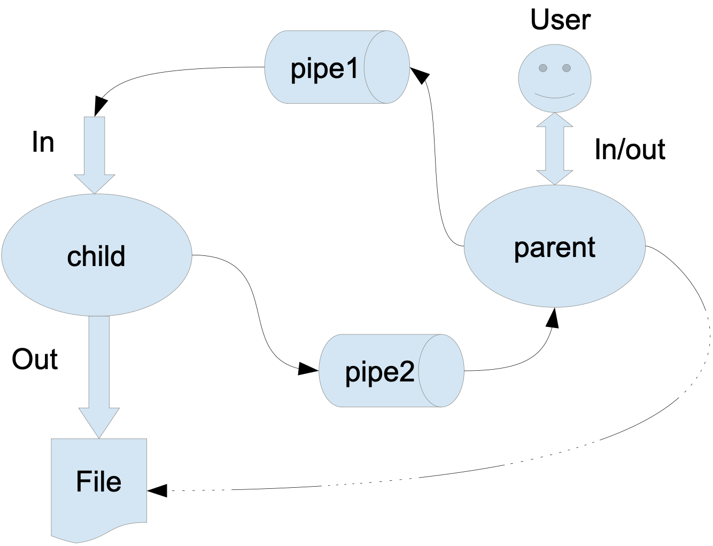

### Задание


```
Родительский процесс создает дочерний процесс. Первой строкой пользователь в консоль
родительского процесса вводит имя файла, которое будет использовано для открытия File с таким
именем на запись. Перенаправление стандартных потоков ввода-вывода показано на картинке
выше. Родительский и дочерний процесс должны быть представлены разными программами.
Родительский процесс принимает от пользователя строки произвольной длины и пересылает их в
pipe1. Процесс child проверяет строки на валидность правилу. Если строка соответствует правилу,
то она выводится в стандартный поток вывода дочернего процесса, иначе в pipe2 выводится
информация об ошибке. Родительский процесс полученные от child ошибки выводит в
стандартный поток вывода.
Вариант 16) Правило проверки: строка должна оканчиваться на «.» или «;»
```

### Сборка
```
gcc -o child 'homeworks/LW_OS_3/child.c'
gcc 'homeworks/LW_OS_3/parent.c'
```

### Запуск
```
./a.out output.txt
```
